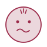
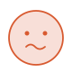
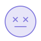
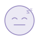
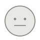
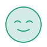
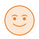
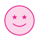
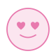

# Aura — Mood Journal

A minimal, thoughtful mood tracking app for iOS. Log how you're feeling each day, track patterns over time, and understand your emotional trends at a glance.

Native iOS companion to the [Android app](https://github.com/eylulnc/Aura-Android), sharing the same Firebase project for cross-platform sync.

<br>

## Mood Icons

13 moods ranging from negative to positive, each with dedicated light and dark variants.

<table>
  <tr>
    <td align="center"><br><sub>Angry</sub></td>
    <td align="center"><br><sub>Overwhelmed</sub></td>
    <td align="center"><br><sub>Anxious</sub></td>
    <td align="center"><br><sub>Sad</sub></td>
    <td align="center"><br><sub>Exhausted</sub></td>
    <td align="center"><br><sub>Tired</sub></td>
    <td align="center"><br><sub>Meh</sub></td>
  </tr>
  <tr>
    <td align="center"><br><sub>Calm</sub></td>
    <td align="center"><br><sub>Good</sub></td>
    <td align="center"><br><sub>Energised</sub></td>
    <td align="center"><br><sub>Happy</sub></td>
    <td align="center"><br><sub>Excited</sub></td>
    <td align="center"><br><sub>Loved</sub></td>
    <td></td>
  </tr>
</table>

<br>

## Features

- **Daily mood logging** — tap the home card to log or edit today's mood via a bottom sheet with a 13-step slider
- **Mood note** — attach a short note (up to 150 characters) to any entry
- **Home dashboard** — streak, days logged this month, top mood, weekly positive %, 7-day trend chart, and top moods breakdown
- **Mood trend chart** — valence-based Y axis with positive/neutral/negative zone bands, gradient fill, and mood-coloured dots
- **History calendar** — colour-coded monthly calendar with a scrollable entry list; navigate to any past month
- **Light & dark mode** — full theme support with dedicated mood icon variants for each theme
- **Sign in with Apple / Google** — optional account with Firestore sync; guest data is preserved on sign-in
- **Offline-first** — full guest mode with no account required; local data is preserved on sign-in

<br>

## Tech Stack

| Layer | Library |
|---|---|
| Language | Swift 6 |
| UI | SwiftUI |
| State | @Observable + SwiftData @Query |
| Local DB | SwiftData |
| Auth | Firebase Auth (Apple + Google) |
| Sync | Cloud Firestore |
| Min iOS | 18.6 |

<br>

## Roadmap

- [x] Foundation — SwiftData model, AuraColors, Dimens, AppPreferences, MoodRepository
- [x] Dashboard screen — mood logging, stat cards, 7-day trend chart, top moods
- [ ] History screen — monthly calendar, entry list, sort, calendar navigation
- [ ] Settings screen — theme toggle, data & privacy sub-screen, app info
- [ ] Sign in with Apple + Google Sign-In + Firestore sync + Onboarding
- [ ] Account deletion + re-auth flow
- [ ] Daily reminder notifications (UNUserNotificationCenter)
- [ ] Home screen widgets (WidgetKit) — today's mood + streak
- [ ] Sync conflict resolution — guest data vs remote account on sign-in

<br>

## Project Structure

```
Features/
├── Dashboard/      # Home dashboard + LogMoodSheet
├── History/        # Calendar + entry list
├── Settings/       # Theme picker, account, data & privacy
└── Onboarding/     # Sign in with Apple / Google sign-in screen

Components/         # MoodImage, TextStatCard, MoodStatCard, MoodTrendCard, TopMoodsCard
Repository/         # MoodRepository, AppPreferences
Models/             # MoodEntry (SwiftData)
Constants/          # MoodFace definitions, MOOD_SLIDER_ORDER, MOOD_VALENCE
UI/Theme/           # AuraColors, Dimens
```

<br>

## Related

- [Android app](https://github.com/eylulnc/Aura-Android) — Kotlin + Jetpack Compose, same Firebase project
</content>
</invoke>