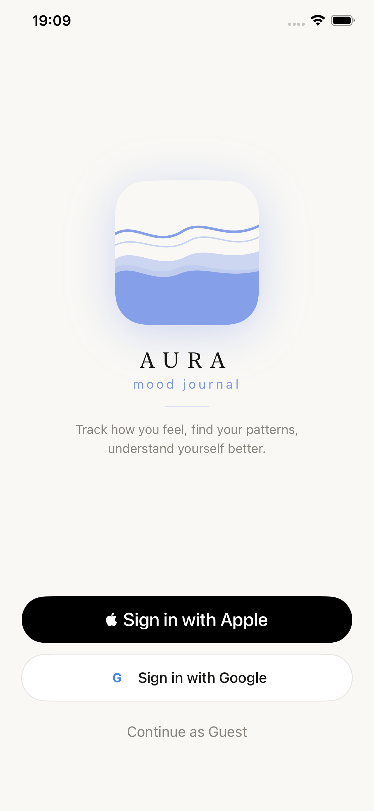
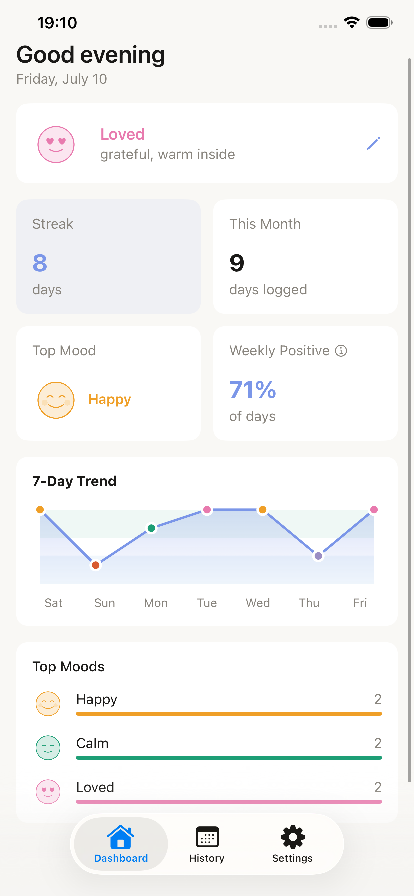
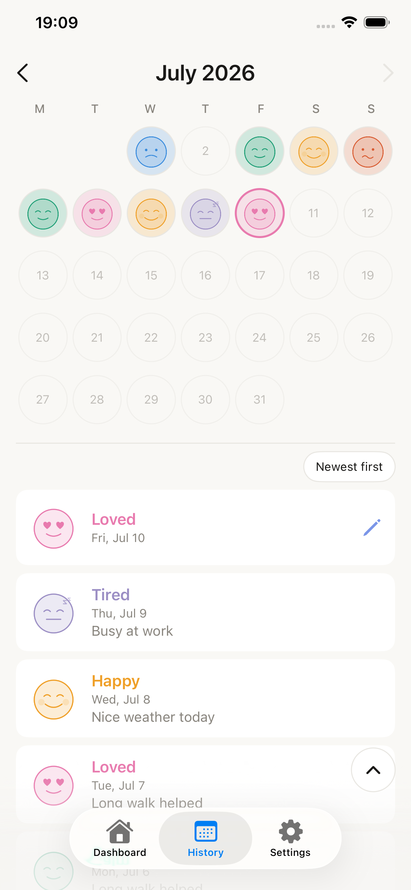
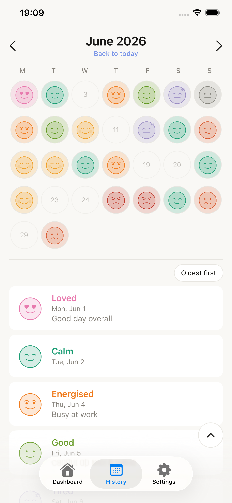
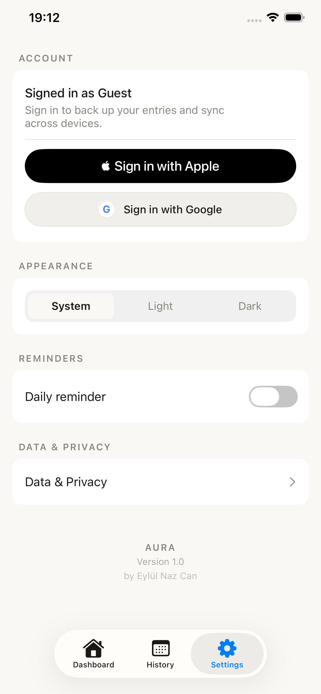
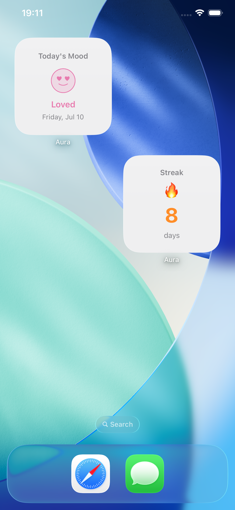

# Aura: Mood Journal

A minimal mood tracking app, **released on the App Store** and on Google Play. Log how you feel each day, spot patterns over time and understand your emotional trends at a glance.

This is the native **iOS** app (SwiftUI + SwiftData). It shares a Firebase project with the [Android app](https://github.com/eylulnc/Aura-Android) (Kotlin + Jetpack Compose), so an account syncs across platforms.

Check App Store : [Aura](https://apps.apple.com/de/app/aura-mood-tracker/id6789640136)

## Screenshots

<table>
  <tr>
    <td align="center"><b>Login</b></td>
    <td align="center"><b>Home</b></td>
    <td align="center"><b>History</b></td>
    <td align="center"><b>History (past month)</b></td>
    <td align="center"><b>Settings</b></td>
  </tr>
  <tr>
    <td></td>
    <td></td>
    <td></td>
    <td></td>
    <td></td>
  </tr>
</table>

### Widgets

<table>
  <tr>
    <td align="center"><b>Today's Mood &amp; Streak</b></td>
  </tr>
  <tr>
    <td></td>
  </tr>
</table>

<br>

## Features

- **Daily mood logging:** tap the home card to log or edit today's mood in a bottom sheet with a 13-step slider
- **Mood note:** attach a short note (up to 150 characters) to any entry
- **Home dashboard:** streak, days logged this month, top mood, weekly positive %, 7-day trend chart, top moods breakdown
- **Mood trend chart:** valence-based Y axis with positive / neutral / negative zones
- **History calendar:** colour-coded monthly calendar with a scrollable entry list
- **Home screen widgets (WidgetKit):** today's mood and current streak
- **Daily reminder** via local notifications
- **Light and dark mode** with dedicated mood icon variants
- **Offline-first guest mode:** no account required
- **Optional Sign in with Apple or Google:** Firestore sync, with guest data preserved on sign-in and a conflict flow when local and remote data both exist
- **Account deletion** with re-authentication (and Apple token revocation, as App Store guidelines require)

## Mood icons

13 moods from negative to positive, each with light and dark variants.

<table>
  <tr>
    <td align="center"><br><sub>Angry</sub></td>
    <td align="center"><br><sub>Overwhelmed</sub></td>
    <td align="center"><br><sub>Anxious</sub></td>
    <td align="center"><br><sub>Sad</sub></td>
    <td align="center"><br><sub>Exhausted</sub></td>
    <td align="center"><br><sub>Tired</sub></td>
    <td align="center"><br><sub>Meh</sub></td>
  </tr>
  <tr>
    <td align="center"><br><sub>Calm</sub></td>
    <td align="center"><br><sub>Good</sub></td>
    <td align="center"><br><sub>Energised</sub></td>
    <td align="center"><br><sub>Happy</sub></td>
    <td align="center"><br><sub>Excited</sub></td>
    <td align="center"><br><sub>Loved</sub></td>
    <td></td>
  </tr>
</table>

## Tech stack

| Layer | Technology |
| --- | --- |
| UI | SwiftUI |
| State | `@Observable`, SwiftData `@Query` |
| Local storage | SwiftData |
| Auth | Firebase Auth (Apple + Google) |
| Sync | Cloud Firestore |
| Widgets | WidgetKit, shared App Group data |
| Notifications | UNUserNotificationCenter |
| Min iOS | 18.6 |

## Architecture

Local-first: SwiftData is the source of truth and Firestore syncs when a user is signed in. A `SyncState` (no data, upload local, download remote, conflict) decides how guest and remote data are reconciled on sign-in.

```
Features/
├── Dashboard/      # Home dashboard + LogMoodSheet
├── History/        # Calendar + entry list
├── Settings/       # Theme, account, data & privacy
└── Onboarding/     # Sign in with Apple / Google or continue as guest
Components/         # MoodImage, stat cards, MoodTrendCard, TopMoodsCard
Repository/         # MoodRepository, AuthRepository, AppPreferences, AppGroup
Services/           # NotificationService
Models/             # MoodEntry (SwiftData)
Constants/          # Mood definitions, valence map, SyncState
AuraWidget/         # Mood and streak widgets
```

## Setup

1. Copy `Keys.xcconfig.example` to `Keys.xcconfig` and fill in your values.
2. Add your own `GoogleService-Info.plist` (not committed).
3. Open `Aura.xcodeproj` in Xcode and run the `Aura` scheme.

## Related

- [Android app](https://github.com/eylulnc/Aura-Android): Kotlin + Jetpack Compose, same Firebase project

## License

MIT, see [LICENSE](LICENSE).
